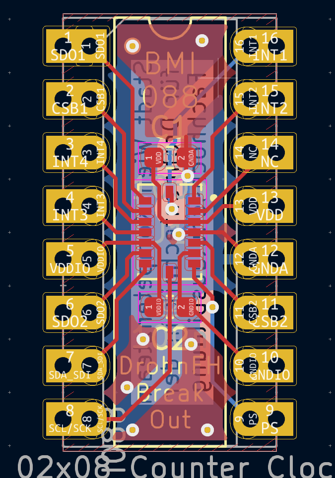
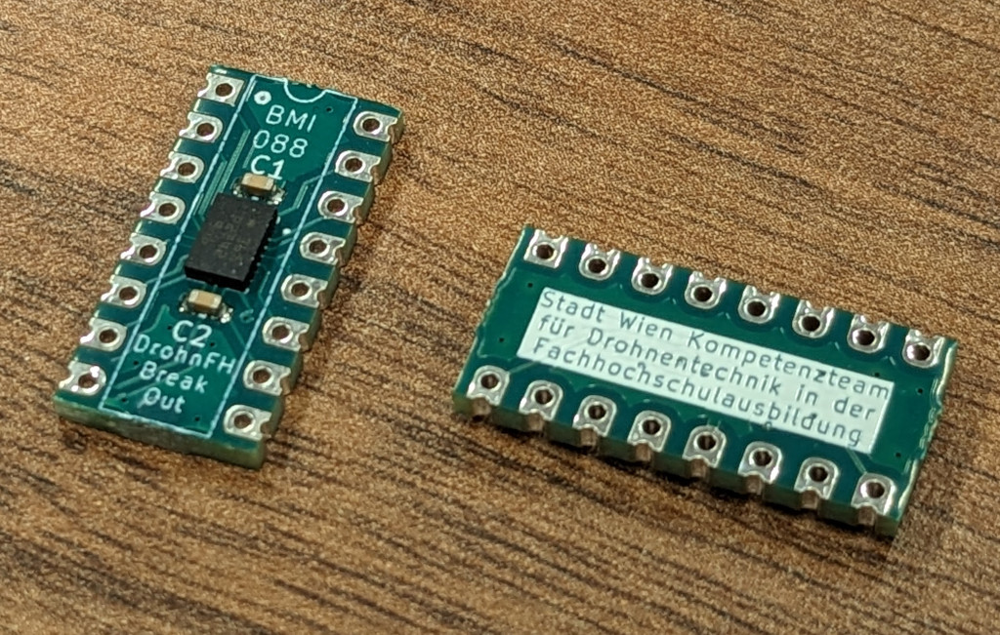

== DrohnFH BMI088 Breakout Board

This breakout board connects all the pins of the BMI088 IMU Sensor IC
to a DIP-16 footprint.

[frame="none",grid="none",cols="^.^4,^.^9,width="100%"]
|====
|  | 
|====

WARNING: To keep routing as simple as possible, it does *not* follow the
conventional DIP pin assignment! Please use the connection diagrams below
to connect the breakout board correctly.

The breakout board's pin assignment can be found in its link:datasheet/datasheet.pdf[Datasheet].

It is pin-compatible with the link:https://github.com/uastw-embsys/icm42688_breakout_board[ICM42688 Breakout Board] for both SPI and I2C.

For further details see the sensor's datasheet (https://www.bosch-sensortec.com/media/boschsensortec/downloads/datasheets/bst-bmi088-ds001.pdf)

=== Revision 2

Revision 2 adds silkscreen markings for the individual pins.
It is electrically otherwise unchanged.

=== Hints

* VDDIO range: 1.2 -- 3.6 V
* VDD range: 2.4 -- 3.6 V

* From the datasheet (pg. 34): "The interface of the gyroscope part is selected by the level of the PS pin. In contrast to this, the accelerometer part starts always in I2C mode
(regardless of the level of the PS pin) and needs to be changed to SPI mode actively by sending
a rising edge on the `CSB1` pin (chip select of the accelerometer), on which the accelerometer
part switches to SPI mode and stays in this mode until the next power-up-reset.
To change the sensor to SPI mode in the initialization phase, the user could perfom a dummy
SPI read operation, e.g. of register `ACC_CHIP_ID` (the obtained value will be invalid)."

For further details see the datasheet (https://www.bosch-sensortec.com/media/boschsensortec/downloads/datasheets/bst-bmi088-ds001.pdf)

=== Acknowledgement

This work was supported by the City of Vienna via the project 
_Stadt Wien Kompetenzteam für Drohnentechnik in der Fachhochschulausbildung_,
MA23 Projekt Nr. 35-02.

[grid="none",frame="none"]
|====
|  |  | 
|====
